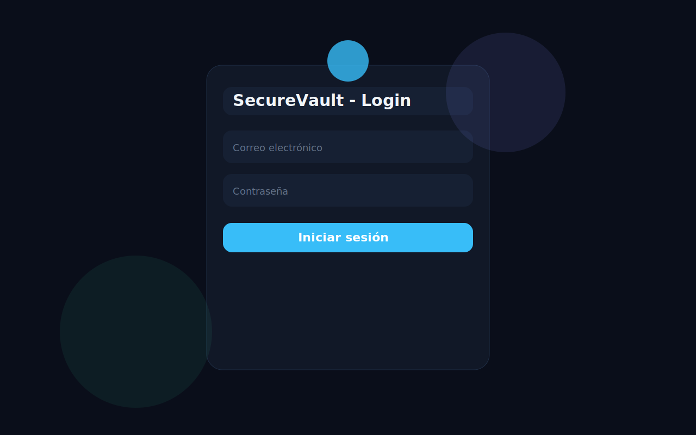
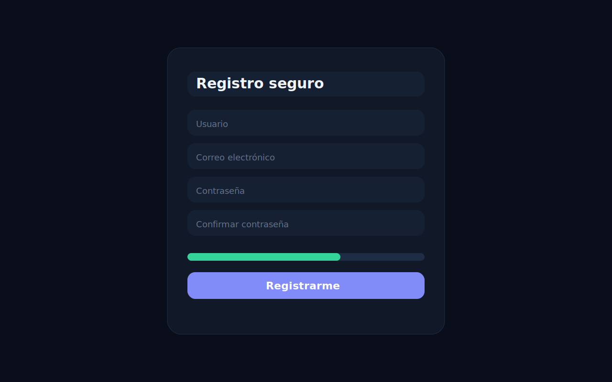
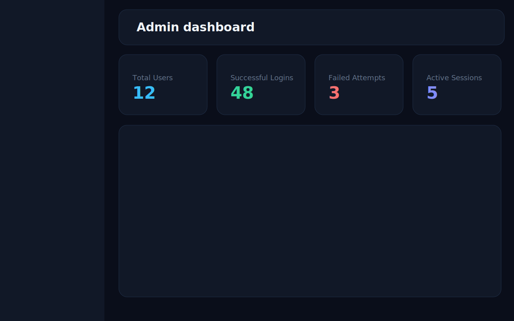
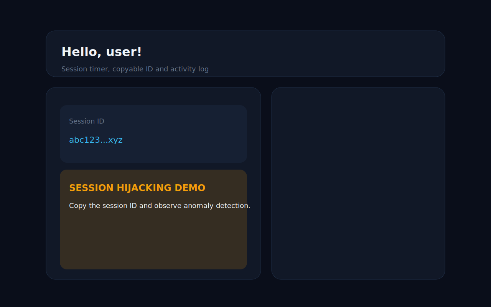

# SecureVault - Secure Web Authentication System

SecureVault es una aplicación web full-stack con autenticación segura, control de roles, bitácoras de auditoría y una demostración controlada de secuestro de sesión. Está construida con Node.js, Express, PostgreSQL, sesiones persistidas con `connect-pg-simple` y una interfaz vanilla HTML/CSS/JavaScript con un tema oscuro creativo.

## Funcionalidades

- Registro e inicio de sesión con `bcryptjs` y validación de entrada.
- Sesiones persistidas en PostgreSQL con regeneración tras login.
- Control de acceso basado en roles para usuario y administrador.
- Tres bitácoras independientes: `ACCESS_OK`, `ACCESS_FAIL` y `LOGOUT`.
- Monitoreo de sesiones activas y sesiones sospechosas.
- Detección demostrativa de anomalías por cambio simultáneo de IP y User-Agent.
- Panel de administración con métricas, usuarios, logs y monitor de sesiones.
- Panel de usuario con detalles de sesión, copia del Session ID y actividad reciente.
- Tema oscuro/luminoso, toasts, reloj en vivo y animaciones visuales.

## Capturas de Pantalla






## Estructura del Proyecto

```text
project-root/
├── server.js
├── package.json
├── .env.example
├── render.yaml
├── db/
│   ├── schema.sql
│   └── pool.js
├── middleware/
│   ├── auth.js
│   └── logger.js
├── routes/
│   ├── authRoutes.js
│   └── dashboardRoutes.js
├── public/
│   ├── css/style.css
│   ├── js/main.js
│   └── pages/
│       ├── index.html
│       ├── register.html
│       ├── admin.html
│       ├── user.html
│       └── 403.html
└── docs/
    └── screenshots/
```

## Instalación Local

1. Instala dependencias:

```bash
npm install
```

2. Crea el archivo `.env` a partir de `.env.example`.

3. Configura PostgreSQL y ejecuta el esquema:

```bash
psql "$DATABASE_URL" -f db/schema.sql
```

En Windows también puedes usar:

```bash
psql -h host -U user -d dbname -f db/schema.sql
```

4. Inicia la app:

```bash
npm start
```

5. Abre `http://localhost:3000`.

## Despliegue en Render.com

1. Sube el repositorio a GitHub.
2. Conecta el repositorio a Render.com.
3. Crea un nuevo Web Service apuntando al repo.
4. Añade una base PostgreSQL gratuita.
5. Configura `SESSION_SECRET` y `DATABASE_URL`.
  - Si usas el `render.yaml` como Blueprint, `SESSION_SECRET` se genera automáticamente.
  - Si creaste el servicio manualmente, debes agregar `SESSION_SECRET` en Variables de Entorno.
6. Verifica que `render.yaml` esté en la raíz del proyecto.
7. Ejecuta el esquema una sola vez con el endpoint protegido:

```text
GET /setup?key=TU_SETUP_KEY
```

8. Comprueba los logs del servicio y las bitácoras en `/api/admin/logs`.

## Cómo funciona el robo de sesión

Esta demo está pensada para educación en seguridad. El objetivo es mostrar que una cookie de sesión robada puede permitir acceso si el sistema no detecta cambios de contexto.

1. Inicia sesión como usuario en Chrome.
2. Abre DevTools y ve a Application > Cookies.
3. Copia el valor de `connect.sid`.
4. Abre Firefox y entra a la URL de la app.
5. Abre DevTools > Application > Cookies.
6. Crea una cookie llamada `connect.sid` con el valor copiado.
7. Navega a `/user`.
8. Observa si el acceso es aceptado o si aparece la alerta de anomalía.
9. Revisa el panel de administración y abre Logs para ver la marca de actividad sospechosa.

## Las 3 Bitácoras

### ACCESS_OK
Se registra cuando un login es exitoso. Incluye usuario, rol, IP, User-Agent, Session ID y timestamp.

Ejemplo:

```text
ACCESS_OK | username=admin | role=admin | ip=127.0.0.1 | sessionId=abc123...
```

### ACCESS_FAIL
Se registra cuando falla el acceso por usuario inexistente, contraseña incorrecta o cuenta inactiva. No crea sesión.

Ejemplo:

```text
ACCESS_FAIL | reason=WRONG_PASSWORD | username=demo | ip=127.0.0.1
```

### LOGOUT
Se registra al cerrar sesión desde `/logout`.

Ejemplo:

```text
LOGOUT | username=demo | sessionId=abc123... | ip=127.0.0.1
```

## Diagrama de Base de Datos

```text
users (1) ----< logs >---- (1) users
  |
  +----< session (connect-pg-simple)

users
- id, username, email, password, role, created_at, is_active

session
- sid, sess, expire

logs
- id, log_type, user_id, username, ip_address, user_agent, session_id, details, created_at
```

## Medidas de Seguridad Implementadas

- Contraseñas hasheadas con `bcryptjs` y `saltRounds = 12`.
- Sesión regenerada tras login para evitar session fixation.
- Cookies `httpOnly`, `sameSite=lax` y `secure` en producción.
- `helmet` para cabeceras de seguridad.
- Rate limit en `/login` de 5 intentos por IP cada 15 minutos.
- Queries SQL parametrizadas en todas las rutas.
- Validación y sanitización de entradas en backend.
- CORS no habilitado por defecto.
- Verificación de rol en servidor para rutas protegidas.
- Sin exposición de stack traces en producción.
- Sesiones guardadas en PostgreSQL, no en memoria.

## Usuario Administrador por Defecto

- Usuario: `admin`
- Correo: `admin@system.com`
- Contraseña: `Admin@12345`

Cambia esta contraseña antes de usar la aplicación en producción.
